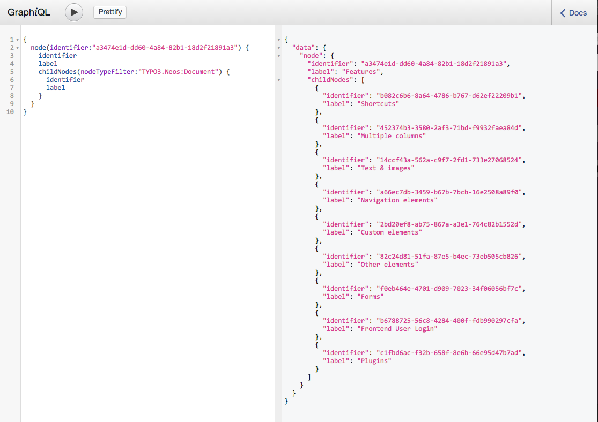
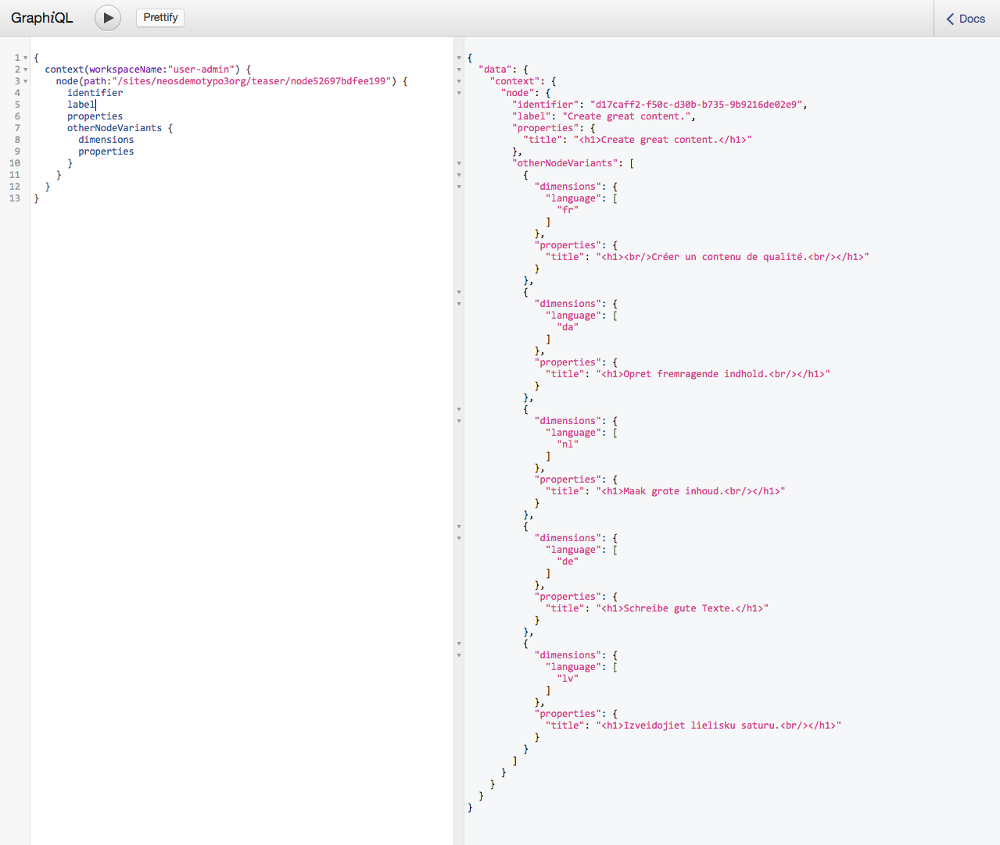
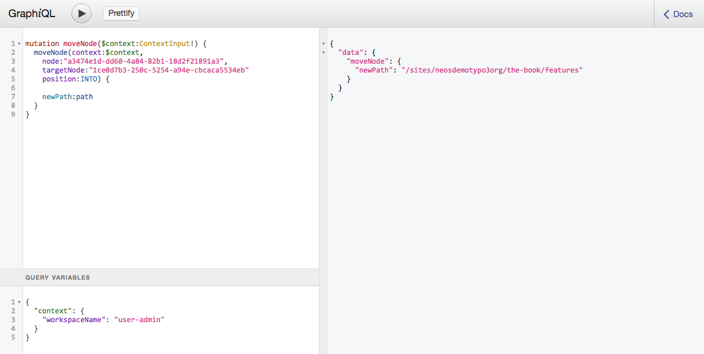

# Wwwision.Neos.GraphQL

An experimental GraphQL API on top of the Neos Content Repository

## Background

This package just comes with a set of GraphQL Type definitions that wrap the public API of the Neos Content Repository.
It depends on the [Wwwision.GraphQL package](https://github.com/bwaidelich/Wwwision.GraphQL) to provide the API endpoint
and to render the GraphiQL IDE.

## Installation

Within an existing Neos instance install the package using [composer](https://getcomposer.org/doc/):

```
composer require wwwision/neos-graphql
```

*Note: Since there is no final release yet, you might need to add `"minimum-stability": "dev"` to your root composer manifest!*

Test whether the GraphiQL IDE works by navigating to `/neos/graphql`.
You should be redirected to the Neos Login form and then back to the GraphiQL interface.

## Usage

All the types, queries and mutations are documented and in sync with the PHP API, so this should be pretty self-explanatory
if you're familiar with [GraphQL](http://graphql.org/) and/or with the [GraphiQL IDE](https://github.com/graphql/graphiql).

Here are some random snapshots of the package in action:

### A simple query to fetch a node in live workspace including its sub-pages:



### Display other dimensions of a given node:



### Move a node into another node and publish the workspace



(Note: this will copy the moved node into the "user-admin" workspace, that can then be published)

## Disclaimer

This package was originally created to evaluate the usage of GraphQL to drive the Neos UI.
Our current standpoint is: For this very scenario (or if one really needs all the low-level power of this API)
this approach might be a viable way.
For providing more high-level or public services for unknown clients to be consumed, there are probably better ways,
including a good old REST API (btw: GraphQL positions itself as *alternative* to REST, not as *replacement*!).

While this package mainly wraps the existing PHP API it is still considered *beta*, mainly because of a few parts that
are likely to change:

* The package key/namespace - I'm not happy with the current name. But if we happen to use it for the Neos Backend this
  will should be moved to the neos vendor namespace anyways.
* The return types of mutations - Currently they return a `MutationResult` with one success flag. This allows us to
  change the implementation to be asynchronous without breaking the types. But the current type is not very useful.
* Some details of the type definitions might need to be revised
